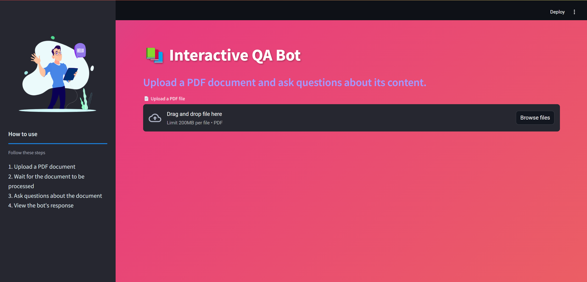
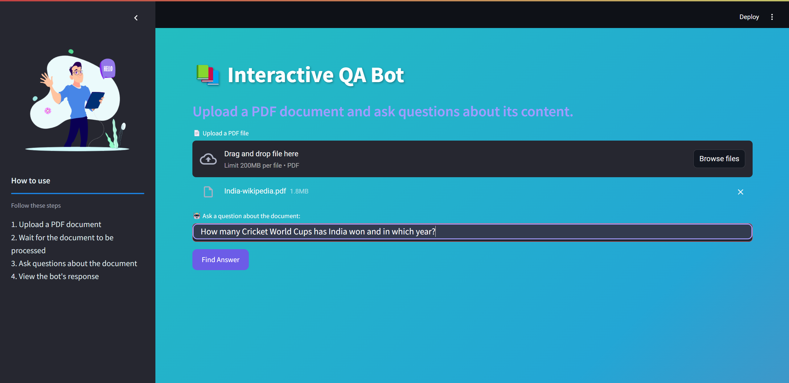
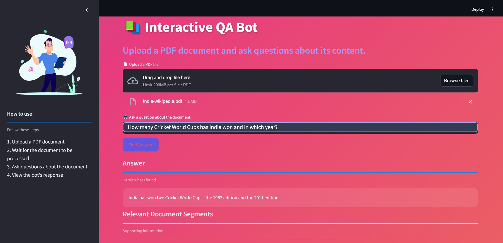
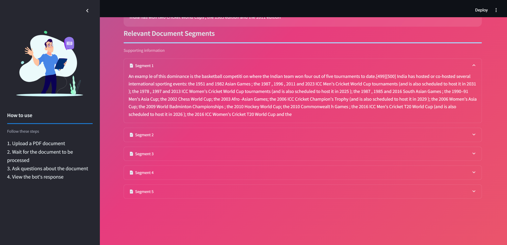

# Interactive QA Bot Using Retrieval-Augmented Generation (RAG)

This project implements a **Retrieval-Augmented Generation (RAG)** system using **Ollama's Llama 3 ChatQA** model, **FAISS** for document indexing, and **Streamlit** for deployment. The QA system can answer queries based on uploaded documents by combining retrieval of relevant document sections with generative language model capabilities.

A Colab notebook, `RAG_QA_System.ipnb`, has been shared to demonstrate the backend of the system.

## Table of Contents
- [Overview](#overview)
- [Model Architecture](#model-architecture)
- [Approach](#approach)
- [Installation and Setup](#installation-and-setup)
- [Usage Instructions](#usage-instructions)
- [Pipeline](#pipeline)
- [Deployment](#deployment)
- [Challenges and Solutions](#challenges-and-solutions)

## Overview
This project allows users to upload PDF documents, and through the **RAG system**, the bot can answer questions based on the content of those documents. The core idea is to use a combination of **retrieval** to extract relevant sections from a large corpus of data and **generative models** to synthesize answers. The system is powered by **Ollama’s Llama 3 ChatQA** model for the generative responses and FAISS for fast document retrieval.

## Model Architecture

### 1. **Retrieval Module**:
   - Uses **FAISS (Facebook AI Similarity Search)** for efficient vector-based document indexing and retrieval. FAISS creates a vector store of document embeddings using **Hugging Face's `sentence-transformers/all-MiniLM-L12-v2`** model for embeddings. This enables quick access to relevant document segments.
   
### 2. **Generative Model**:
   - **Ollama's Llama 3 ChatQA** is used as the large language model (LLM) to generate answers. This model is specifically designed for answering questions in a conversational manner.

### 3. **Document Processing**:
   - PDF documents are processed into manageable chunks using **RecursiveCharacterTextSplitter** from Langchain. The text chunks are indexed in FAISS for efficient retrieval.
   
### 4. **Query Processing**:
   - A question from the user is processed through the system. The RAG system retrieves the top 5 most relevant chunks from the FAISS index and feeds them to the Llama 3 ChatQA model to generate a final answer.

## Approach

### Retrieval Augmentation:
We use a **two-step approach**:
1. **Document Processing and Indexing**: Uploaded documents are split into smaller chunks and embedded into vectors for indexing using FAISS. This is critical for fast and accurate retrieval of the most relevant document sections.
2. **Generative Response Creation**: Upon receiving a query, the system retrieves the relevant document chunks and passes them to the generative model for creating a detailed response.

### Why RAG?
RAG combines the power of retrieval-based systems, which excel in factual accuracy by drawing from a defined corpus, with generative models that can synthesize and present information in a user-friendly, conversational format. It helps mitigate hallucination issues common in LLMs by grounding responses in actual document content.

## Installation and Setup

### Prerequisites:
- Python 3.10+
- [Ollama](https://ollama.com/download) installed

### Step-by-Step Setup:

1. **Clone the Repository**:
    ```bash
    git clone https://github.com/ronit-singhal/your-repo-name.git
    cd your-repo-name
    ```

2. **Install Dependencies**:
    Install required Python packages using `pip`:
    ```bash
    pip install -r requirements.txt
    ```

3. **Download the Llama 3 Model**:
    To download the model for generative responses, run the following command:
    ```bash
    ollama run llama3-chatqa
    ```

4. **Run the Application**:
    Start the application using Streamlit:
    ```bash
    streamlit run app.py
    ```

## Usage Instructions

1. **Launch the App**:
   - After setting up the environment, open your terminal and run the Streamlit app:
    Open your terminal and run the Streamlit app:
    ```bash
    streamlit run app.py
    ```

   - You will be greeted by the initial page where you can upload a document and start asking questions



2. **Upload a PDF Document**:
    - On the web interface, upload your PDF document.
    - The document will be processed and indexed in the background. You will see a success message once the process is complete.
    - After uploading the document, you will see a text input box where you can enter your question



3. **Ask Questions**:
    - After entering a question in the input box, click on Find Answer. The system will process the question, retrieve relevant sections of the document, and generate an answer.



4. **View Results**:
    - After displaying the answer, the app will also show the document segments that were used to generate the response. These segments can be expanded and viewed for context..



## Pipeline

1. **Document Ingestion**:
   - The PDF is uploaded via the Streamlit interface and passed through the `load_documents()` function in `RAGQASystem.py`, which splits it into smaller chunks using the RecursiveCharacterTextSplitter.
   
2. **Document Indexing**:
   - Text chunks are embedded using the `sentence-transformers/all-MiniLM-L12-v2` model and indexed using FAISS for efficient retrieval.

3. **Query Handling**:
   - The user's query is processed by the `answer_question()` method in `RAGQASystem.py`. FAISS retrieves relevant document chunks, and the Llama 3 ChatQA model generates a response.

4. **Response Generation**:
   - The generative model uses retrieved document chunks to craft a factually accurate answer, displayed on the web interface.

## Deployment

### Local Deployment:
1. Ensure that **Streamlit** is installed and all dependencies are satisfied.
2. Use the following command to deploy the app locally:
    ```bash
    streamlit run app.py
    ```

### Cloud Deployment:
- You can deploy this project to **Streamlit Cloud**, **Heroku**, or any other cloud platform supporting Python apps.
- Make sure the cloud environment has access to **Ollama** and is configured with the correct API tokens if required.

### Docker Deployment:
You can containerize the application with Docker for ease of deployment across various environments:
1. Build a Docker image:
    ```bash
    docker build -t rag-qa-bot .
    ```
2. Run the Docker container:
    ```bash
    docker run -p 8501:8501 rag-qa-bot
    ```

## Challenges and Solutions

### 1. **Memory Management**: 
   - Processing large PDF documents could lead to memory issues. We addressed this by implementing efficient text splitting and using FAISS for indexing, which allows for out-of-core processing.

### 2. **Response Accuracy**: 
   - Ensuring that the LLM provides accurate answers based solely on the retrieved context was challenging. We implemented a strict system prompt and used a low temperature setting to encourage more factual responses.

### 3. **Performance Optimization**: 
   - Balancing between retrieval accuracy and speed was crucial. We optimized this by fine-tuning the number of retrieved documents (k=5) and using an efficient embedding model.

## Future Work
- **Multi-document support**: Extend the functionality to handle multiple documents in a single query.
- **Model Fine-tuning**: Fine-tune the model for specific use cases like legal or medical document QA.
- **Better LLM and Embedding Models**: Integrate more advanced language models and embedding techniques to improve accuracy and response quality. These improvements may require larger GPU support to handle more complex computations efficiently.